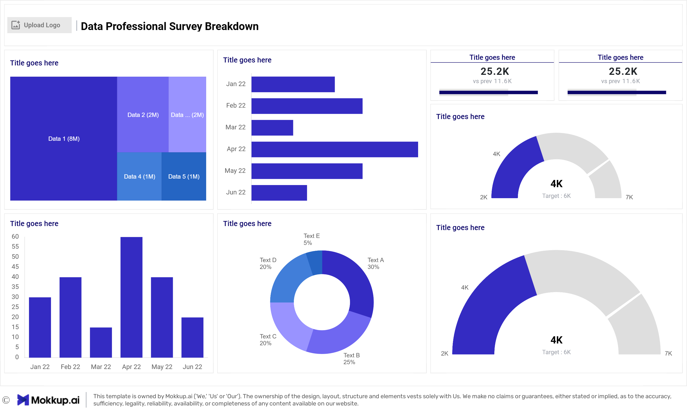

# Portfolio: Data Professionals Survey

## Power BI project

This project was developed using raw data collected from social meadia following a survey conducted among professionals in the field of data. The data was transformed using Power Query, and visualizations were created and finalized in a dashboard using Power BI
# Table of contents

- [Objective](#objective)
- [Data source](#data_source)
- [Stages](#stages)
- [Design](#design)
 
# Objective:

## Key Pain Point:
The Head of Human Resources wants to understand the demographics and satisfaction levels of data professionals to enhance recruitment and retention strategies.

### Ideal Solution:
To create a dashboard that provides comprehensive insights into the survey data of data professionals, including their:

   * Countries 
   * Salaries
   * Job titles
   * Ages
   * Programming languages

This dashboard will assist the Human Resources team in making informed decisions to improve recruitment processes, tailor professional development programs, and enhance overall employee satisfaction and retention.

# Data source

The Social Media Department conducted a survey on Twitter, Instagram, Facebook, and LinkedIn, and provided us with [ths resulting raw data](https://github.com/EthelChila01/Data-Professional-Survey-Breakdown/tree/main/assets/dataset)

# Stages

* Design
* Data cleaning
* Analysis
* Visualization

# Design
   *  Dashboard components required
To understand what it should contain, we need to figure out what questions we need the dashboard to answer:
   1. Which countries took part in the survey?
   2. How many people took part in the survey?
   3. What are their average salaries respective of their jobtitles
   4. What is the avarage age of the survey takers?
   5. What is the most their favourite programming language?
   6. How difficult was it to break into the data field?
   7. How satisfied are they with their salaries?
   8. How happy are they with their Work-life balance
For now, these are some of the questions we need to answer, this may change as we progress down our analysis.

## Dashboard mockup
   *  What should it look like?
Some of the data visuals that may be appropriate in answering our questions include:
   1.  A tree map
   2.  Card
   3.  stacked bar chart
   4.  Stacked column chart
   5.  Guage
   6.  Pie chart

